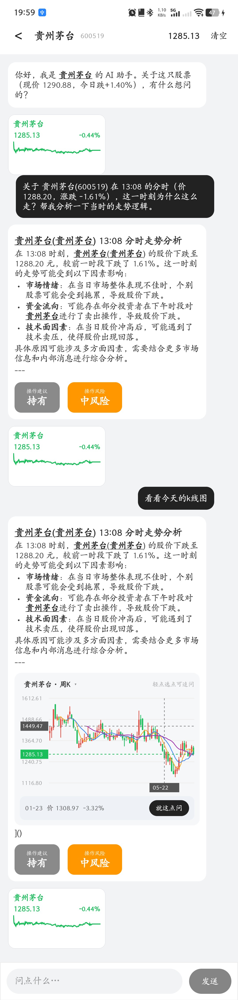
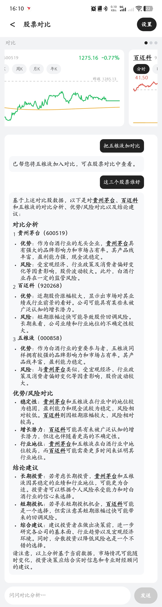
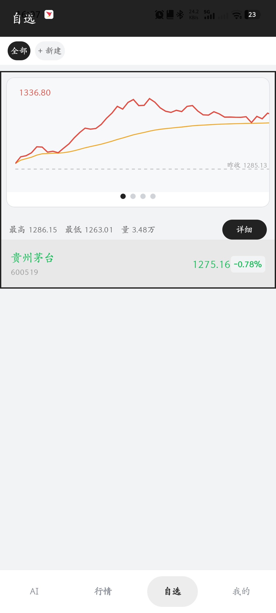

<div align="center">
  
  <h1>KuiklyStock</h1>
</div>

基于 **Kuikly + Kotlin Multiplatform** 开发的股票行情与 AI 问答 App —— 把行情浏览、自选管理、多股对比和个股 AI 解读串进同一套 Kotlin 页面。共享 UI 与业务逻辑都在 `shared/src/commonMain`，Android 宿主只负责桥接平台能力。

适合按「看行情 → 进个股 → 读 AI 分析 → 加自选 / 直接让 AI 操作 App」这条链路演示。

> 本项目是 **2026 腾讯犀牛鸟开源人才计划 · KuiklyUI 实战**的参赛作品，仅用于学习与产品原型演示，**不构成任何投资建议**，也不提供真实证券交易。行情来自公开免费接口，AI 结论由大模型生成，两者都可能出错。

---

## 演示视频与截图

### 功能演示视频

[**B 站 · KuiklyStock 功能演示**](https://www.bilibili.com/video/BV1PWYE6LEke)（约 5 分半）

走了一遍行情浏览、AI 聊天逐字输出、AI Agent 操作 App、图表选点问 AI。

### 直接装到手机上试

[**KuiklyStock-debug.apk**](KuiklyStock-debug.apk)（约 4.9 MB）

下载后允许「未知来源应用」即可安装，打开就能用，AI 部分需要联网。这是 Debug 构建的包，功能和源码一致。

### 页面截图

| AI 聊天 + AI Agent | 个股详情 |
| :---: | :---: |
| [](docs/screenshots/01-ai-chat-and-agent.jpg) | [](docs/screenshots/02-stock-detail.jpg) |
| **多股对比** | **自选与个性化** |
| [](docs/screenshots/03-compare.jpg) | [](docs/screenshots/04-watchlist.jpg) |

---

## 核心功能

### Task 1 · AI 行情原型

- **行情浏览**：大盘指数、板块、个股榜单三块常驻，支持分类切换与下拉刷新；接腾讯与新浪两家真实接口。
- **个股详情**：价格、涨跌与成交指标，分时 / 日K / 周K / 月K / 年K 可切，K 线支持缩放、技术指标（MACD / RSI / BOLL）与十字光标选点。
- **板块详情**：概念 / 行业板块及其成分股，板块内可继续点进个股。
- **自选管理**：加自选、排序、隐藏与恢复，状态本地持久化。
- **多股对比**：上多股走势轮播、下对比 AI 对话，配独立选股页。
- **开始选股**：条件筛选入口。

### Task 2 · AI 股票问答

- **真流式输出**：走 GLM 的 SSE 流逐字渲染，不是前端假打字机。
- **富文本回复**：Markdown 渲染，回复里提到的股票自动变成可点窄卡，可进详情或直接追问。
- **图表选点问 AI**：分时或 K 线点选任意一根出十字光标，带着这个点位的时间与价格跳聊天自动提问，做到「看哪根就问哪根」。
- **量化结论徽章**：AI 分析额外产出「操作建议（买 / 持 / 卖）」与「风险（低 / 中 / 高）」两个徽章。

### 超出题目的部分 · AI Agent

用自然语言直接操作 App，模型自行判断意图并真实执行，共支持 9 个工具：

改主题色、改字号、换涨跌配色、开关迷你卡、设隐藏恢复天数、恢复隐藏股、加自选、加对比、设预警。

协议层做了 JSON 容错、工具名别名归一化（小模型常把 `setThemeColor` 自由发挥成 `change_theme_color` 之类）、失败短路（执行失败直接回准确错误，不让模型编）。

---

## 项目亮点

| 亮点 | 实现方式 |
| --- | --- |
| 页面全在共享层 | 13 个页面都用 Kuikly DSL 写在 `commonMain`，`observable` 驱动响应式；宿主只提供 行情 / AI / 存储 三类桥 |
| 行情三源互补 | 腾讯给报价、K 线与分时；新浪给榜单、板块与成分；东方财富给 F10 基本面。mock 只在离线兜底，且明确标注 |
| 北交所代码平移 | 北交所 2025 年切到 `920` 代码段，旧代码各源已停更；`secidOfCode` 统一平移，历史 K 线走新浪、沪深仍走腾讯 |
| AI Agent 协议 | 模型决策 + `⟦TOOL⟧{json}` + 别名归一化 + 失败短路，小模型也能稳定选路 |
| 真流式渲染 | SSE 逐字输出；Mock 兜底与真实会话在 UI 上可区分 |
| 自研图表 | 不引第三方图表库，Canvas 手写 K 线 / 分时 / 迷你走势，支持缩放、指标与十字光标 |
| 图表 ↔ 对话打通 | K 线任意位置可点选，带着该点上下文跳聊天追问 |

---

## 技术栈

| 分类 | 技术 / 版本 |
| --- | --- |
| 跨端框架 | Kuikly Open `2.7.0-2.1.21` |
| 语言与共享模块 | Kotlin / Kotlin Multiplatform `2.1.21` |
| 页面与状态 | Kuikly DSL、`@Page`、`BasePager`、`observable` |
| Android 构建 | Gradle Wrapper `8.5`、AGP `7.4.2`、Gradle JDK `17` |
| Android SDK | compileSdk `34`、targetSdk `30`、minSdk `23` |
| 行情接入 | 腾讯（报价 / K线 / 分时）、新浪（榜单 / 板块 / 成分）、东方财富（F10） |
| AI 接入 | 智谱 GLM-4-Flash 免费池，SSE 流式；宿主 Bridge + `HttpURLConnection` |
| 图表 | 自研 Canvas 组件（K 线 / 分时 / 迷你走势） |
| 序列化 | Kuikly JSON（共享层）/ `org.json`（宿主侧） |
| 本地存储 | 宿主 `SharedPreferences`（经 Bridge） |

> 版本取自当前仓库的构建配置，不代表对各依赖最新版本的声明。

---

## 架构与目录

### 分层职责

```text
Kuikly 页面 / 组件（shared/commonMain）
  ├─ StockData（行情门面）─────→ 宿主 Bridge → 腾讯 / 新浪 / 东方财富
  ├─ LLM（GLMFlashClient）────→ 宿主 Bridge → 智谱 GLM（SSE 流式）
  │    └─ MockLLMClient（离线 / 限流兜底）
  ├─ AgentChat ───────────────→ 工具协议 → 操作 UserSettings / 自选 / 对比 / 预警
  └─ UserSettings / UserStockStore / ChatStore → 宿主 Bridge → SharedPreferences
```

- **页面层**：展示、交互、生命周期与路由；不承担行情解析和协议容错。
- **模型与门面层**：`Stock` / `KLineBar` / `Sector` 等模型，`StockData` 统一收口真实数据与 mock 兜底。
- **宿主层**：渲染容器、路由 / 图片 / 字体 / 日志适配，行情网络请求、GLM 调用与本地存储。

### 目录结构

```text
KuiklyStock/
├─ androidApp/src/main/java/.../           # Android 宿主（13 个 .kt）
│  ├─ KuiklyRenderActivity.kt              # 渲染容器，默认加载 MainTab
│  ├─ adapter/                             # 路由、图片、字体、日志、异常适配
│  └─ module/KRBridgeModule.kt             # 行情 / K线 / 分时 / F10 / GLM / 存储 桥接
└─ shared/src/commonMain/kotlin/.../       # 共享层（49 个 .kt）
   ├─ base/         BasePager / BridgeModule / Utils
   ├─ core/         Stock · StockData · StockBrief · StockMention · KRMarkdown
   │  │             UserSettings · UserStockStore · AlertStore
   │  └─ llm/       LLMClient · GLMFlashClient · MockLLMClient · AIJobCenter
   │                ChatStore · AIAnalysisStore · AgentChat · AgentActions
   ├─ components/   KRStockList · KRKLineChart · KRTrendChart · KRMiniTimeSharing
   │                KRChatMiniChart · KRStockCard · KRStockBadge · AiVerdict …
   └─ app/          main · chat · detail · compare · mine · quotes
```

### 页面路由

```text
MainTab（四 Tab 主框架：AI 聊天 / 行情 / 自选 / 我的）
  ├─ 行情 Tab ──────┐
  ├─ 自选 Tab ──────┼──→ StockDetail（个股详情）
  └─ 我的 Tab ──────┘    SectorDetail（板块详情）

MainTab ──→ Chat（AI 对话）
        ──→ StockCompare / StockPicker / HeatPool / QuotesPage
        ──→ Appearance / ExpandSettings / HiddenStocks / Credits / FullText
```

页面通过 `@Page` 注册（KSP 自动扫描），继承 `BasePager`，用 `RouterModule` 跳转，共 13 个路由页。

---

## 本地运行（Android）

**评审最简单的路径：clone → 用 Android Studio 打开 → Run。** 不用申请 Key、不用建配置文件，AI 直接是真模型 —— 仓库里带了一个共享的智谱 GLM 免费池 Key（见 `glm.default.properties`），仅用于评审体验。

**环境**：Android Studio（≥ 2024.2.1）+ Kuikly 插件、Gradle JDK **17**、Android SDK 34；运行设备需 Android 6.0 / API 23 及以上。

1. **打开工程**：用 Android Studio 打开仓库根目录，等 Gradle Sync 完成。AS 会自动生成 `local.properties`（里面只有一行 `sdk.dir`）。
2. **纯命令行构建**（可选）：照 `local.properties.example` 复制一份，填上自己的 SDK 路径；也可以改用环境变量 `ANDROID_HOME`。
3. **换自己的 AI Key**（可选）：在 `local.properties` 加一行 `GLM_API_KEY=你的智谱Key`，覆盖仓库里的共享 Key。
4. **运行**：选 `androidApp` → Run。入口页是 `MainTab`。

```bash
# 命令行构建 APK
./gradlew :androidApp:assembleDebug
# 产物：androidApp/build/outputs/apk/debug/androidApp-debug.apk
```

macOS / Linux 若报 `permission denied`，先执行 `chmod +x gradlew`。

### 编译共享层与宿主

```bash
# 共享层 Kotlin（判 UP-TO-DATE 时加 --rerun-tasks）
./gradlew :shared:compileDebugKotlinAndroid

# 宿主 Kotlin
./gradlew :androidApp:compileDebugKotlin
```

### AI 这块要留意

- 本项目**只适配了智谱 GLM 的协议**，填别家的 Key 不会生效（会走本地兜底，不会崩）。
- Key 读取优先级：`local.properties` → 环境变量 `GLM_API_KEY` → 仓库里的 `glm.default.properties`。
- Key 缺失、限流、超时都会自动回退本地兜底，界面与交互照常。

---

## 已知限制（如实说明）

- **只落地了 Android**。H5 / 鸿蒙 / iOS 做过可行性验证但未落地：H5 所需的 `core-render-web` 在当前 Kuikly 版本里是源码子模块而非 Maven 产物；鸿蒙需 DevEco Studio + 真机且桥要重写整套 ArkTS；iOS 需要 Mac。因此把精力回投到 Android 的功能与代码质量。
- **AI 快慢取决于 GLM 免费池**：高峰期可能慢或限流（会自动降级候选模型 / 超时回 Mock）。录演示建议挑 GLM 通畅的时候。
- **只有真实 GLM 走流式**：Mock 是本地即时生成的，没有中间态。
- **键盘顶起方式**：沉浸式全屏下靠输入栏后面的占位 Spacer 把输入栏顶上去，而不是整页重排（Kuikly / 沉浸式系统行为）。
- **共享 Key 仅供评审**：`glm.default.properties` 里的 Key 已在公开仓库中，答辩结束后会轮换。

---

## 补充文档

- [架构说明.md](架构说明.md) —— 技术架构与关键设计
- [亮点与创新.md](亮点与创新.md) —— 可讲亮点清单
- [比赛自评与答辩要点.md](比赛自评与答辩要点.md) —— 评分自证与答辩要点
- [演示口播脚本.md](演示口播脚本.md) · [演示镜头时间轴录制卡.md](演示镜头时间轴录制卡.md) —— 演示视频配套材料

历史文档仅供参考；功能范围、路由与平台状态以当前源码及本 README 为准。
